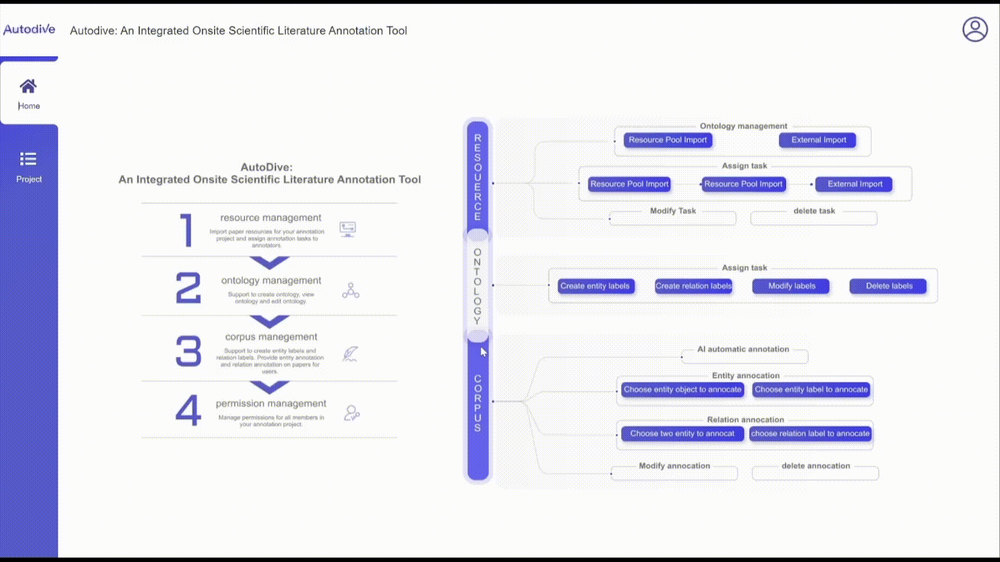
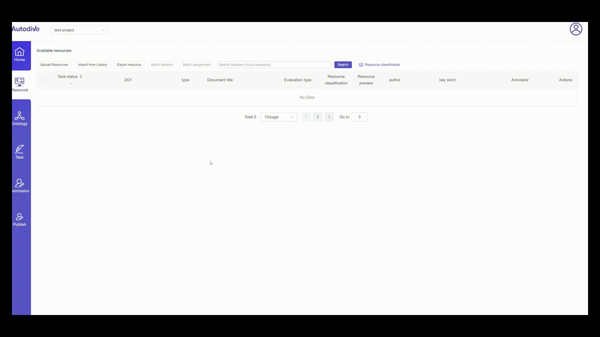
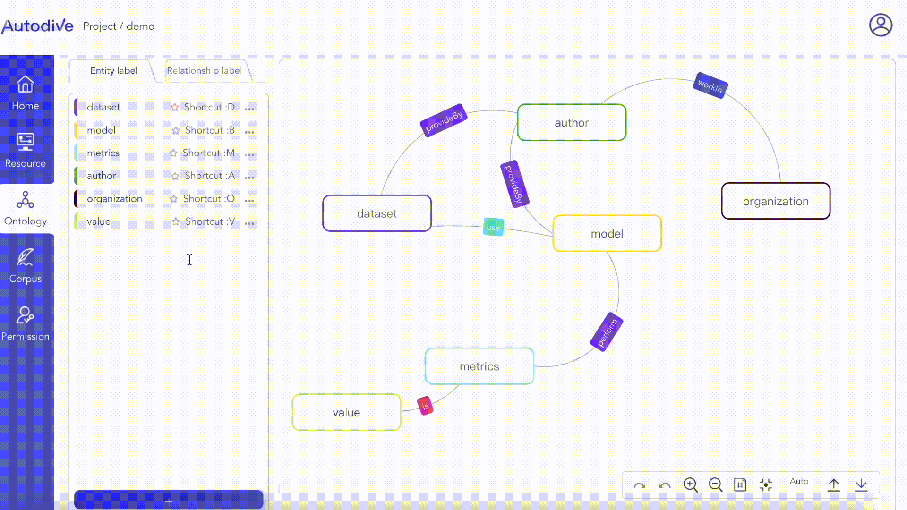
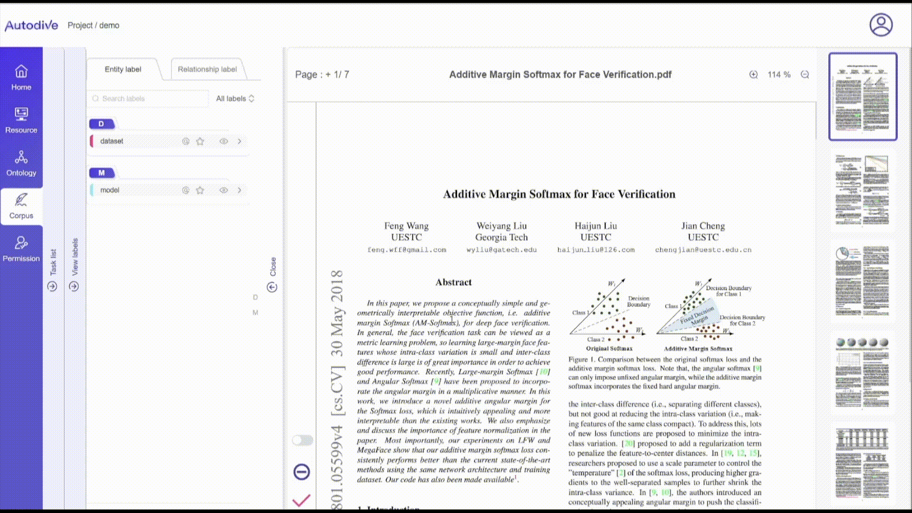
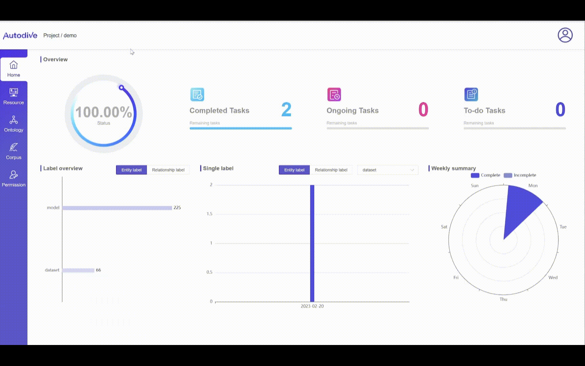

# AutoDive : An Integrated Onsite Scientific Literature Annotation Tool

We introduce AutoDive, an integrated onsite scientific literature annotation tool Autodive for AI/NLP researcher and domain scientist. This tool provides six core functions of annotation that support the whole lifecycle of corpus generation. They are i)project management, ii)resource management, iii)ontology management, iv)pre-annotation configuration, v)onsite annotation and vi)statistic view. 

## Online Demo
We deploy an live demo of AutoDive at [http://autodive.sciwiki.cn/](http://autodive.sciwiki.cn/)(test username:  *test*, password: *autodive*) or watch our demostration video on Youtube at .

## Installation
* install git and clone the project to your local computer.
    *   git clone [https://github.com/Autodive/autodive-frontend.git](https://github.com/Autodive/autodive-frontend.git)
* install node16
    *   补充命令
* 这个命令是干啥？
    *   yarn --registry https://registry.npmmirror.com
    *   yarn build
* Access [http://127.0.0.1:xxx](http://127.0.0.1:xxx) in browser.
* Done.
## Main Functions
### Create Project

### Task Assign

### Create Ontology

### Manual Annotation

### Auto Annotation

### Corpus Export

### Project Review

## License:
This annotation tool is licensed under [Apache License  Version 2.0](https://github.com/Autodive/autodive-frontend/blob/master/LICENSE)
